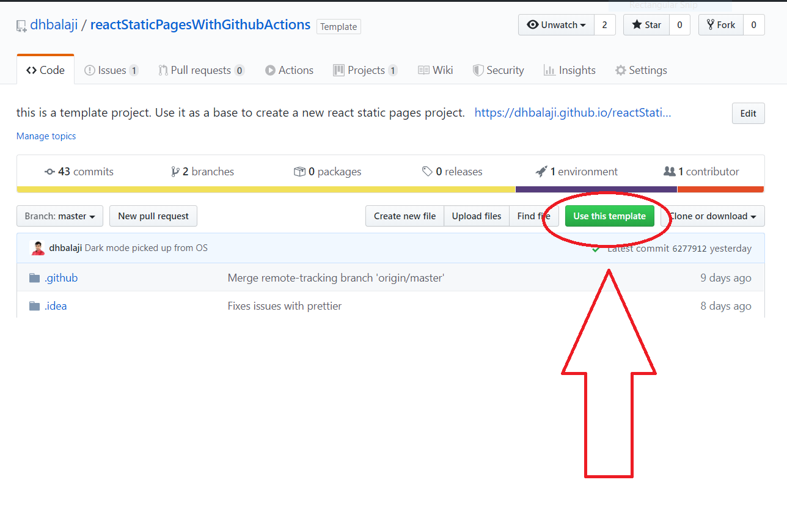
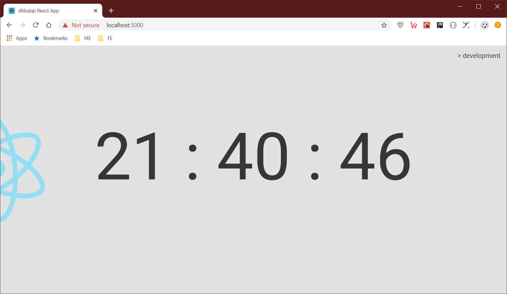
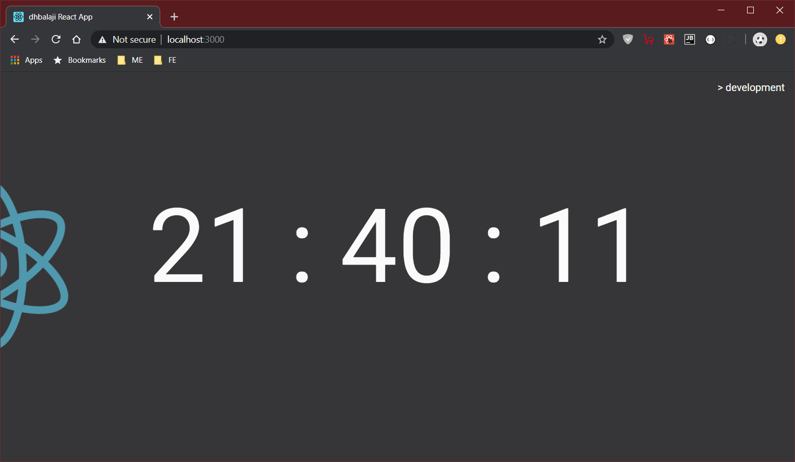
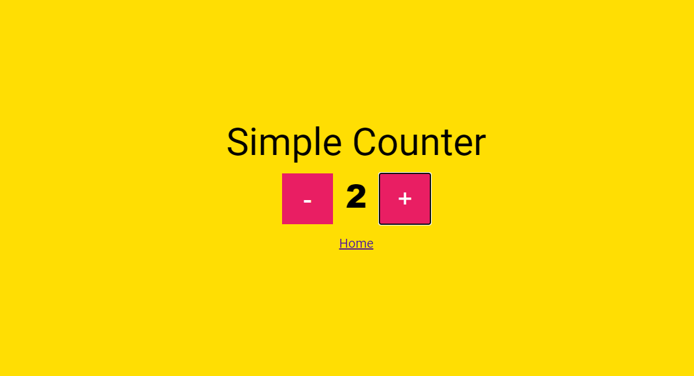

## React Static Pages Template

> If you are `show me the code` type of person, head to <a href="https://codesandbox.io/s/github/dhbalaji/reactStaticPagesWithGithubActions?file=/src/App.js" target="_blank">CodeSandbox</a>

> `npx degit dhbalaji/react-prod-ready-template react-app` on your terminal to get started

This project customizes create-react-app scaffold and makes it better for building production ready static page apps in react.

We have added support for 

* SCSS {dart-sass}
* Out of the box support for `env` for variables
* Prettier for code style
* Dark mode styling with CSS Media queries. Prints only in bright mode.
* React router for navigating between pages
* React redux boilerplate
* ImmutableJS for redux store
* Pre-configured CI/CD with github actions

> This repo is always up to date with latest npm packages.

## To get started

1. `git clone git@github.com:dhbalaji/reactStaticPagesWithGithubActions.git`
2. `cd reactStaticPagesWithGithubActions`
3. `npm install`
4. `npm start`

If you are on github watching this, just click on `use this template` button. The code will be copied to a new repository and you can use the code as a boilerplate to get started.

Visit [localhost](http://localhost:3000) on your browser. If you are using `Webstorm IDE`. The workspace would have been imported automatically and the localhost runs on `https`. Use <https://localhost:3000> to see the output.

Your localhost should show a `dynamic digital clock` which ticks every second.The output should look as follows.

> The light/dark mode is auto detected from the client OS through CSS Media queries.

### On light mode, the output would be similar to the below screenshot.

### On dark mode, the output would be similar to the below screenshot.

A dead simple `counter` example in react, redux, redux-thunk.

